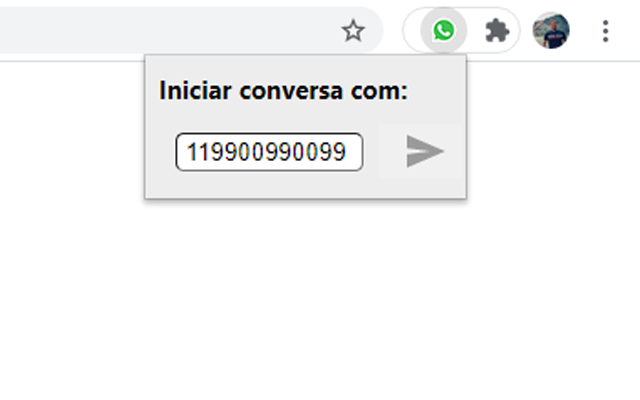

# WhatsApp Message Start

Start a new WhatsApp Web conversation without adding the phone number to your contact list.



## Change log

1.2
```
Set input focus on open extension
Starting a conversation upon enter press
```

1.1
```
Closing extesion popup after initializing the conversation
Focusing the WhatsApp tab after initializing the conversation
```

1.0
```
Initial version release
```
